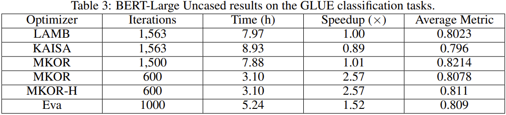

# MKOR: Momentum-Enabled Kronecker-Factor-Based Optimizer Using Rank-1 Updates

This repo contains the source code of the Python package `mkor`.We only support PyTorch for now. 
See our paper for a detailed description of MKOR.
 
We have tested MKOR on BERT-Large-Uncased pretraining and ResNet-50 
training as two examples. MKOR outperforms state-of-the-art 
first-order methods, e.g. 
the LAMB optimizer, and best implementations of second-order methods,
i.e. KAISA/KFAC, up to 2.57x and 1.85x respectively 
on BERT-Large-Uncased on 64 GPUs.

**MKOR: Momentum-Enabled Kronecker-Factor-Based Optimizer Using Rank-1 Updates**

*Mohammad Mozaffari, Sikan Li, Zhao Zhang, Maryam Mehri Dehnavi*

Paper: [https://neurips.cc/virtual/2023/poster/70683](https://neurips.cc/virtual/2023/poster/70683)


MKOR Reduces the computation and communication complexity of 
second-order optimizers from cubic and quadratic
to quadratic, and linear respectively. This allows MKOR to update
the second-order information more frequently, and thus to improve
the convergence rate of the optimizer. Also, a hybrid version of
MKOR (called MKOR-H) is proposed that mid-training falls back to a
first order optimizer if the second order updates no longer
accelerate convergence. 

[//]: # (Below, the MKOR algorithm is shown.)

[//]: # ()
[//]: # (![Alt text]&#40;./assets/MKOR-Algorithm.png "MKOR Algorithm"&#41;)

## Quickstart
1. Installing MKOR:
```angular2html
pip install mkor
# Alternatively
# pip install git+https://github.com/Mohammad-Mozaffari/mkor
```
2. Define the model, your choice of optimizer (MKOR can initialize
SGD and ADAMW by taking `'sgd'` and `'adamw'` as the optimizer),
gradient scaler, and the distributed backend, and the list of the 
model layers that won't use second-order information.
3. Initialize MKOR:
```python
from mkor import MKOR
optimizer = MKOR(
                 model,
                 stat_decay=0.95,
                 inv_freq=10,
                 stabilization_factor=0.1,
                 measure_time=False,
                 backend=backend,
                 half_precision=True,
                 grad_accum_steps=grad_accum_steps,
                 sgd_layers=sgd_layers, # List of layers that won't use second-order information
                 optimizer='sgd, # 'sgd' or 'adamw' or an instance of torch.optim.Optimizer
                 grad_scale=scaler.get_scale(),
                 clipping_value=100.0,
                 warmup_steps=10, 
                 **optimizer_args)
```
4. Train the model and update the optimizer gradient scaler:
```python
# Forward pass
# Loss computation
optimizer.zero_grad()
loss.backward()
optimizer.step()
scaler.update_scale()
optimizer.update_grad_scale(scaler.get_scale())
```


## Experiments

### BERT-Large-Uncased Pretraining
We have pretrained BERT-Large-Uncased using different optimizers,
and have fine-tuned the pretrained models on the SQuAD v1.1 and 
GLUE datasets. The accuracy results and the corresponding speedups
are reported in the following tables.





For reproducing the results, you can use the code available in 
`examples/bert`. In our experiments, we use the 
NVIDIA BERT-Large-Uncased implementation from 
[this](https://github.com/gpauloski/BERT-PyTorch/tree/master) repo, and have integrated MKOR as an external 
optimizer to it. For getting the desired results, please use 
the hyperparameters mentioned in the paper. If any hyperparameter 
isn't mentioned in the paper, please use the default value from the 
original repo.


Scripts for fine-tuning the checkpoints on SQuAD dataset are in 
`examples/bert/scripts` and instructions for fine-tuning the 
checkpoints on the GLUE dataset are avaialbe in 
`NVIDIA BERT fine-tuning GLUE.md` inside the `examples/bert` folder.

Currently, gathering the datasets for BERT Pretraining might not be 
feasible, since the datasets are not publicly available. For 
accessing the datasets, please reach out the authors of 
MKOR or [KAISA](https://arxiv.org/pdf/2107.01739.pdf).

### ResNet-50 Training
We use MKOR for training ResNet-50 on the ImageNet dataset.
The following figure shows the convergence of MKOR compared to
other second-order and first-order optimizers.


We use the implementation of [this](https://github.com/gpauloski/kfac-pytorch/tree/v0.3.1) repo, and have 
integrated MKOR as an external optimizer to it.
You can find the code in `examples/resnet50` folder. For getting 
the desired results, please use the hyperparameters mentioned in 
the paper. If any hyperparameter isn't mentioned in the paper, 
please use the default value from the original repo.

## Citation
If you use MKOR in your research, please cite our paper:
```angular2html
@inproceedings{
    mozaffari2023mkor,
    title={{MKOR}: Momentum-Enabled Kronecker-Factor-Based Optimizer Using Rank-1 Updates},
    author={Mohammad Mozaffari and Sikan Li and Zhao Zhang and Maryam Mehri Dehnavi},
    booktitle={Thirty-seventh Conference on Neural Information Processing Systems},
    year={2023},
    url={https://openreview.net/forum?id=jcnvDO96N5}
}
```